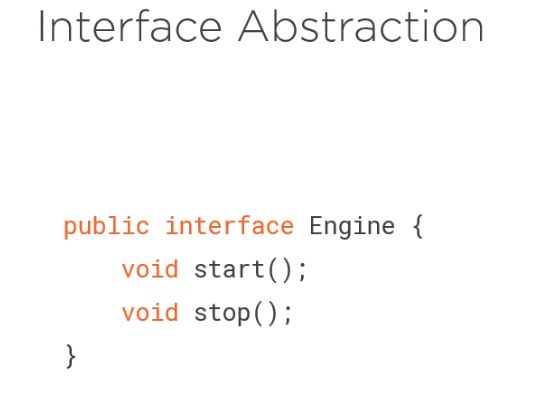
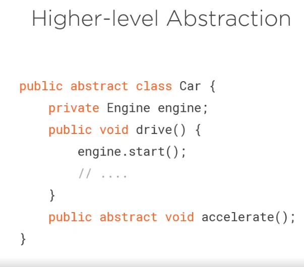
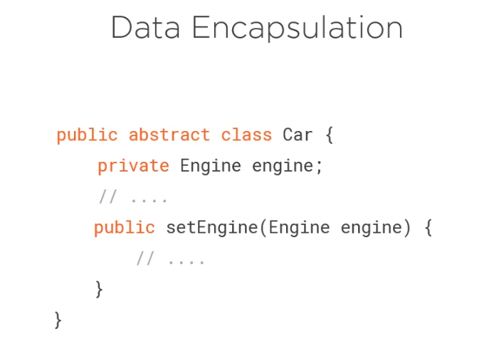
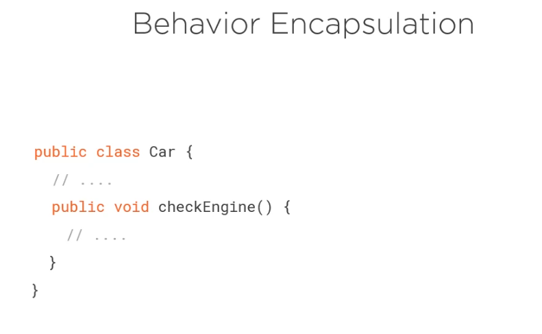
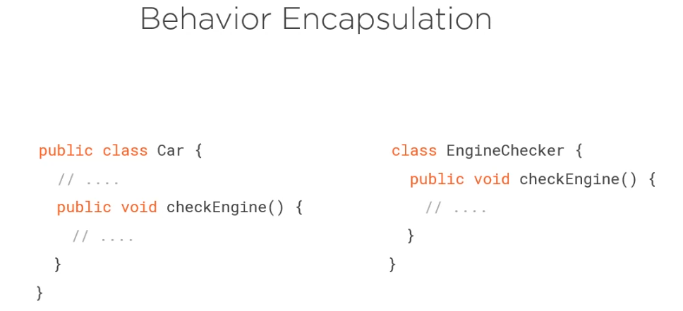

# Design-Patterns
This repo contains the materials and code to demonstrate the design patterns

Design Patterns Gang of Four.

Deign Pattern is a reuable and named solution to a recurring problem in a context.

Patterns are Discovered Not Created.

Object Oriented Programming.

OOP Building Blocks

1) ABSTRACTION
Is about identifying the essential details or characterestics of an object with an objective to hiding the complexity of how they are implemented.

In java the Abstraction is achieved through interfaces and abstract classes

In this case we can use Abstraction of and Engine to compose abstraciton of a car.

2) ENCAPSULATION
Is all about hiding information. Here is the idea is to protect the applicaiton from one part of the application from other part. So in this case if you have to change one part you dont have to change the other part too.

For lot of people encapsulation is to set the member variables as private and provide setter and getter to control access to these variables.

Encapsulation can also seperate behaviour from other parts of the application

3) INHERITANCE

4) POLYMORPHISM

